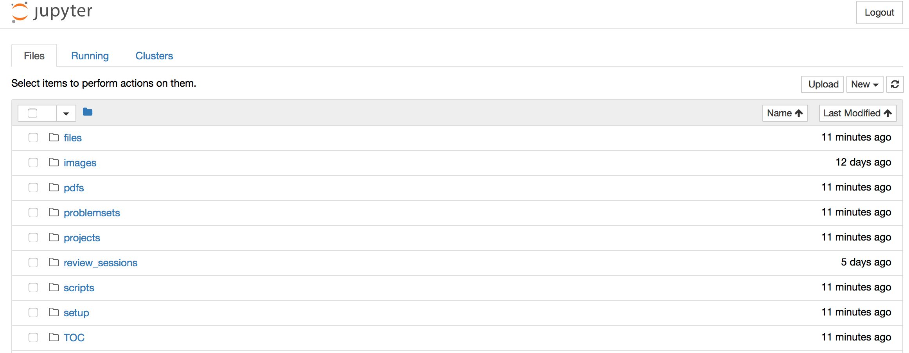

# Jupyter Notebook (JN)

Previously called iPython notebook. An interactive 'lab notebook' for writing code experiments. It stores code and can link to data files and can run the code on the data. Oh, and it looks like a web page and runs inside your web browser, so you can add formatting and images (plots, graphs, diagrams, photos etc).  

You can run a notebook locally (we'll be doing that) or over a network from a server.

The notebooks we'll be running run python (inside a 'kernel'). There are kernels for many languages. The most interesting alternative for bioinformatics is R, a statistical language that has amazing graphing and other analysis tools.

Having your code documented in a notebook means you can rerun it any time and get exactly the same output.  You can also share easily and document what you did clearly. It's perfect for bioinformatics projects.

## Installing jupyter notebook

You'll need a good browser like firefox or chrome. Others might work ok. You also need python 3.3+

JN is part of [anaconda](https://store.continuum.io/cshop/anaconda/) created by Continuum , so it's on the computers we are using. You can also get it through `pip`  or conda `conda install jupyter`

You'll launch it like this

```bash
% jupyter notebook &
```

Remember the `&` means run this command in the background. Jupyter starts in the directory you are in when it's launched.

You'll see a lot of messages appear in the screen and a broswer window will open. 





You can start a new project and make other files with the New drop down menu

Let's click on the projects folder and make a new folder in there. Click on the box next to the new 'Untitled Folder' and select rename above to chance the name to final_project. 


If you click on the final_project directory, you'll see a new empty directory.


