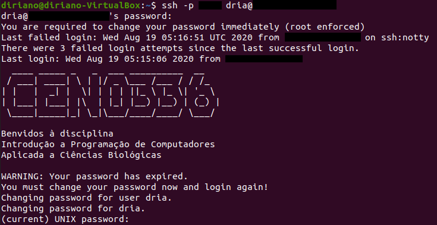
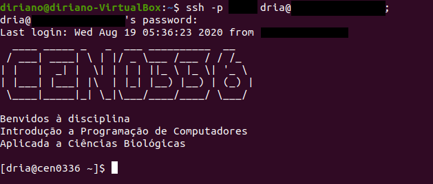
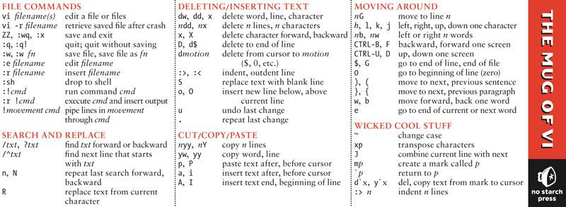
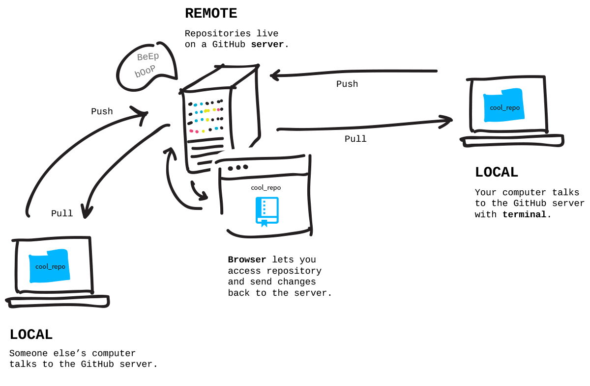
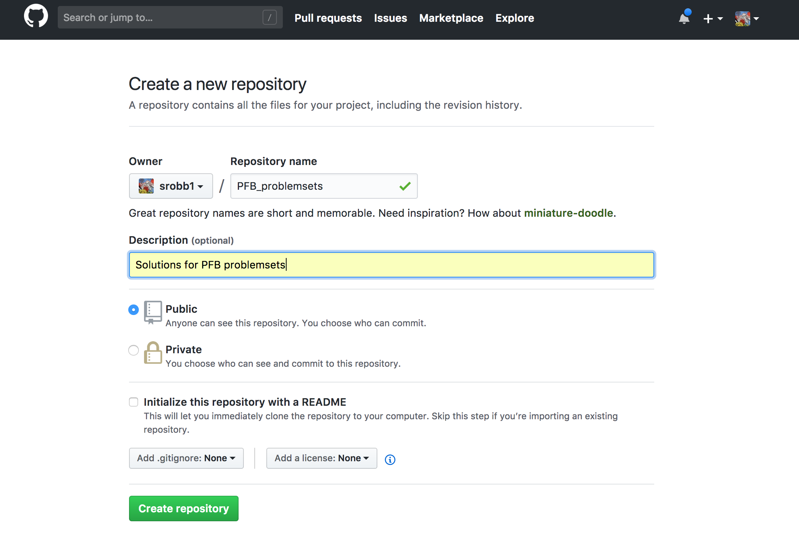
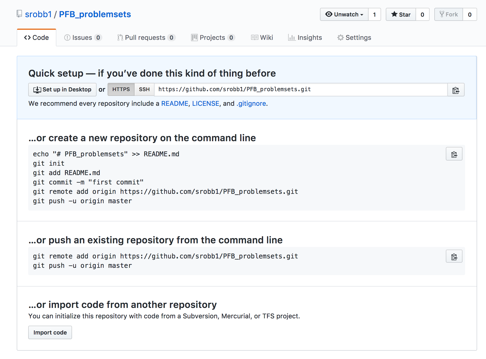

# Introdução a programação de computadores aplicada a ciências biológicas - CEN0336 2020-20
Tradução e modificação do material associado a [programmingforbiology.org](http://programmingforbiology.org)

__Criador e Instrutor da versão em Português__
Diego M. Riaño-Pachón

__Criadores do material na versão em Inglês__  
Simon Prochnik  
Sofia Robb     

# Panorama geral

## Por que?

Por que é importante para profissionais das ciências da vida aprender a programar?

Possivelmente você já tem a resposta a essa pergunta, a final das contas, você está aqui!

Estmaos convencidos que saber programar é tão essencial quanto fazer uma electroforese em gel o preparar uma reação de PCR. Os dados que hoje podemos obter de um só experimento podem ser esmagadores. i Esse dados muitas vezes precisam ser reformatados, filtrados e analizados de formas únicas. A programação de computadores permitirá que você execute essas taferas de uma maneira **eficiente** e **reproducivel**.


## Dicas úteis

Algumas dicas para cursar uma disciplina de programação com sucesso


1. Pratica, pratica, pratica. Por favor, invista tnato tempo como seja possivel escrevendo código.

2. Limite-se a escrever uma linha ou duas de codigo, e teste-las. Se você escreve muitas linhas, será mais dificil corregir os erros (debug), caso tiver.

3. Os erros não são fracassos. Cada erro é uma oportunidade de aprendizagem. Cada erro que você pesca e corrige (debug) e um grande sucesso. Corregir erros é como você cimenta seu aprendizado.

4. Não gaste muito tempo tentando descifrar um problema. Claro, é uma experiencia de aprendizado resolver os problemas você mesmo, mas a frustração e o bloqueio não são. Estamos aqui para ajuda-los, pergunte cada vez que precisar.

5. As palestras são importantes, mas a pratica e muito mais importante.

6. Sessões de revisão são importantes, mas a pratica e muito mais importante.

7. Nosso principal objetivo é ensinar-les a resolver problemas vocês mesmo, devagar mas com segurança.

---

# Unix

## Unix 1

### Panorama de Unix

#### O que é a linha de comandos?

Subjacente a qualsquer interface gráfica (GUI) existe um poderoso sistema operacional (SO) de linha de comandos. A linha de comandos oferece acesso ao interior do SO, e é também uma forma conveniente de escrever software e scripts personalizados.

Muitas das ferramentas bioinformáticas são desenvolvidas para ser executadas na linha de comando e não ter uma GUI. Em muitos casos, uma ferramenta na linha de comandos e mais versatil que uma ferramente gráfica, já que você pode combinar facilmente diversas ferramentas de linha de comandos para criar scripts que realizem tarefas sem a intervenção de um humano.

Nesta disciplinas, vocês escreverão scripts na linguagem Python e os executarão exclusivamente desde uma linha de comandos.

### O básico

#### Detalhes para entrar no seu ambiente de trabalho

Nesta disciplina, neste semestre, usaremos um servidor Linux com CenOS 7, o endereço (IP), e porta de acesso, do servidor serão informados durante um dos encontros com o professor, por favor tome nota dessa informação e mantenha-la para uso rápido.

Para entrar no servidor, você tem que fornecer seu nome de usuário e a senha. Seu nome de usuário será a primeira letra do seu nome e as três primeiras letras do seu sobrenome. No sistema e-Disciplinas da USP tem uma tabela com os nomes de usuários de todos os alunos. A senha é CEN0336XXX, onde XXX são os três ultimos digitos do seu número USP.

Por exemplo, para o Prof. Diego Riano, o nome de usuário é: dria.

_Your username:_ dria

_Your password:_ CEN0336XXX

#### Conectando-se ao servidor

Para conectar ao servidor precisarão de um cliente de SSH (Secure shell). 

Os usuários de windows podem descarregar os software [Putty](https://www.chiark.greenend.org.uk/~sgtatham/putty/latest.html)

Os usuários de Linux ou de MacOS, já tem um cliente de ssh no sistema operacional, só tem que iniciar o aplicativo Terminal.

Detalhes para usar o cliente de SSH serão mostrados no encontro com o professor.

Na sua primeira entrada no servidor, terá que trocar sua senha. Por favor escolha uma senha dificil de adivinhar. O servidor pedirá usa senha original duas vezes, e depois você terá que digitar sua nova senha duas vezes. Será recebido por uma janela semelhante a seguinte:



Nessa primeira entrada, o servidor o desconectará imediatamente depois da troca da senha. Tem que se conectar de novo, desta vez usando a nova senha que escolheu no passo anterior. Estará numa janela semelhante a seguinte:



Você pode manter abertas varias janelas desse terminal. Isso geralmente é útil.

Durante a disciplina vamos usar muito esse terminal.

#### OK. Entrei no servidor. E agora?

A janela da terminal está executando uma **shell** chamada de "bash." A shell é um loop (ciclo) que:  
1. Imprime o prompt
2. Lê uma linha de entrada do teclado
3. Analisa a linha em um ou mais comandos
4. Executa os comandos (geralmente imprimindo algum tipo de daida na terminal)
5. Volta ao passo 1.


Existem muitas shells diferentes, com nomes bizarros como **bash**, **sh**, **csh**, **tcsh**, **ksh**, e **zsh**.  A particula "sh" no nome, significa shell.  Cada shell é sutilmente diferente e algumas vezes confusa. suas contas no servidor estão configuradas para usar a shell **bash**.


#### Prompt da linha de comandos


A maior parte da bioinformática é feita executando software numa shell da linha de comandos, por isso é importante aprender a usar a shell de forma efetiva.


Este é um exemplo de prompt na linha de comandos:

```
cen0336>
```


Aqui tem outro:

```
(~) 51%
```

Mais um:

```
dria@cen0336 1:12PM>
```

O que você vai ter como prompt depende de como o administrador do sistema fez a configuração. Mas, você pode mudá-lo, [claro depois de saber como!](https://linuxconfig.org/bash-prompt-basics).

O prompt indica à shell que está pronto para aceitar comandos. Quando um programa esta rodando, o prompt não aparece até que o sistema estiver pronto para lidar com uma nova solicitação.

#### Executando comandos


Escreva um comando e pressione a tecla &lt;Enter&gt;.  Se o comando produz alguma saida, esta aparecerá na tela.  Por exemplo:

```
(~) 53% ls -F
GNUstep/                 cool_elegans.movies.txt  man/
INBOX                    docs/                    mtv/
INBOX~                   etc/                     nsmail/
Mail@                    games/                   pcod/
News/                    get_this_book.txt        projects/
axhome/                  jcod/                    public_html/
bin/                     lib/                     src/
build/                   linux/                   tmp/
ccod/
(~) 54%
```

O comando aqui é `ls -F`, que gera uma lista dos arquivos e pastas dentro da pasta atual (já falaremos disso). Abaixo do comando aparece sua saída, é o prompt aparece novamente.


Alguns programas podem demorar muito tempo para rodar. Depois que você executa eles, não recuperará o prompt da shell até eles terminarem a tarefa que les foi encomendada. Nesse caso você poderia abrir um novo terminal par acontinuar seus trabalhos, ou rodar o comando no segundo plano adicionando o simbolo "&" após o comando, no final da linha.

```
(~) 54% long_running_application &
(~) 55%
```
> The command will now run in the background until it is finished. If it has any output, the output will be printed to the terminal window. You may wish to capture the output in a file (called redirection). We'll describe this later.

#### Command-Line Editing

Most shells offer command-line editing.  Up until the comment you press \<Enter\>, you can go back over the command-line and edit it using the keyboard.  Here are the most useful keystrokes:

- _Backspace_: Delete the previous character and back up one.
- _Left arrow_, right arrow: Move the text insertion point (cursor) one character to the left or right.
- _control-a (^a)_: Move the cursor to the beginning of the line. (Mnemonic: A is first letter of alphabet)
- _control-e (^e)_: Move the cursor to the end of the line. Mnemonic: E for the End (^z was already used for interrupt a command).
- _control-d (^d)_: Delete the character currently under the cursor. D=Delete.
- _control-k (^k)_: Delete the entire line from the cursor to the end. k=kill.  The line isn't actually deleted, but put into a temporary holding place called the "kill buffer". This is like cutting text
- _control-y (^y)_: Paste the contents of the kill buffer onto the command-line starting at the cursor.  y=yank. This is like paste.
- _Up arrow, down arrow_: Move up and down in the command history.  This lets you reissue previous commands, possibly after modifying them.

There are also some useful shell commands you can issue:  

- `history` Show all the commands that you have issued recently, nicely numbered.
- `!<number>` Reissue an old command, based on its number (which you can get from `history`).
- `!!` Reissue the immediate previous command.
- `!<partial command string>`: Reissue the previous command that began with the indicated letters.  For example, `!l` (the letter el, not a number 1) would reissue the`ls -F` command from the earlier example.

**bash** offers automatic command completion and spelling correction.  If you type part of a command and then the tab key, it will prompt you with all the possible completions of the command.  For example:

```
(~) 51% fd<tab><tab>
(~) 51% fd
fd2ps    fdesign  fdformat fdlist   fdmount  fdmountd fdrawcmd fdumount
(~) 51%
```
> If you hit tab after typing a command, but before pressing \<Enter\>, **bash** will prompt you with a list of file names. This is because many commands operate on files.

#### Wildcards

You can use wildcards when referring to files.  `*` stands for zero or more characters.  `?` stands for any single character.  For example, to list all files with the extension ".txt", run `ls` with the wildcard pattern "*.txt"

```
(~) 56% ls -F *.txt
final_exam_questions.txt  genomics_problem.txt
genebridge.txt            mapping_run.txt
```

There are several more advanced types of wildcard patterns that you can read about in the **tcsh** manual page.  For example, if you want to match files that begin with the characters "f" or "g" and end with ".txt", you can use a range of characters inside square brackets `[f-g]` as part of the wildcard pattern. Here's an example

```
(~) 57% ls -F [f-g]*.txt
final_exam_questions.txt  genebridge.txt            genomics_problem.txt
```

#### Home Sweet Home


When you first log in, you'll be placed in a part of the system that is your personal directory, called the _home directory_.  You are free to do with this area what you will: in particular you can create and delete files and other directories.  In general, you cannot create files elsewhere in the system.

Your home directory lives somewhere in the filesystem.  On our iMacs, it is a directory with the same name as your login name, located in `/Users`.  The full directory path is therefore `/Users/username`.  Since this is a pain to write, the shell allows you to abbreviate it as `~username` (where "username" is your user name), or simply as `~`.  The weird character (called "tilde" or "twiddle") is usually hidden at the upper left corner of your keyboard.

To see what is in your home directory, issue the command `ls -F`:

```
(~) % ls -F
INBOX         Mail/         News/         nsmail/       public_html/
```

This shows one file "INBOX" and four directories ("Mail", "News") and so on.  (The `-F` in the command turns on fancy mode, which appends special characters to directory listings to tell you more about what you're seeing.  `/` at the end of a filename means that file is a directory.)


In addition to the files and directories shown with `ls -F`, there may be one or more hidden files.  These are files and directories whose names start with a `.` (called the "dot" character).  To see these hidden files, add an `a` to the options sent to the `ls` command:

```
(~) % ls -aF
./                .cshrc            .login            Mail/
../               .fetchhost        .netscape/        News/
.Xauthority       .fvwmrc           .xinitrc*         nsmail/
.Xdefaults        .history          .xsession@        public_html/
.bash_profile     .less             .xsession-errors
.bashrc           .lessrc           INBOX
```
> Whoa!  There's a lot of hidden stuff there.  But don't go deleting dot files.  Many of them are essential configuration files for commands and other programs.  For example, the `.profile` file contains configuration information for the **bash** shell.  You can peek into it and see all of **bash**'s many options.  You can edit it (when you know what you're doing) in order to change things like the command prompt and command search path.


#### Getting Around


You can move around from directory to directory using the `cd` command.  Give the name of the directory you want to move to, or give no name to move back to your home directory.  Use the `pwd` command to see where you are (or rely on the prompt, if configured):

```
(~/docs/grad_course/i) 56% cd
(~) 57% cd /
(/) 58% ls -F
bin/         dosc/        gmon.out     mnt/         sbin/
boot/        etc/         home@        net/         tmp/
cdrom/       fastboot     lib/         proc/        usr/
dev/         floppy/      lost+found/  root/        var/
(/) 59% cd ~/docs/
(~/docs) 60% pwd
/usr/home/lstein/docs
(~/docs) 62% cd ../projects/
(~/projects) 63% ls
Ace-browser/               bass.patch
Ace-perl/                  cgi/
Foo/                       cgi3/
Interface/                 computertalk/
Net-Interface-0.02/        crypt-cbc.patch
Net-Interface-0.02.tar.gz  fixer/
Pts/                       fixer.tcsh
Pts.bak/                   introspect.pl*
PubMed/                    introspection.pm
SNPdb/                     rhmap/
Tie-DBI/                   sbox/
ace/                       sbox-1.00/
atir/                      sbox-1.00.tgz
bass-1.30a/                zhmapper.tar.gz
bass-1.30a.tar.gz
(~/projects) 64%
```
> Each directory contains two special hidden directories named `.` and `..`. The first, `.` refers always to the current directory. `..` refers to the parent directory.  This lets you move upward in the directory hierarchy like this:

```
(~/docs) 64% cd ..
```

and to do arbitrarily weird things like this:

```
(~/docs) 65% cd ../../lstein/docs
```
> The latter command moves upward two levels, and then into a directory named `docs` inside a directory called `lstein`.


If you get lost, the `pwd` command prints out the full path to the current directory:

```
(~) 56% pwd
/Users/lstein
```

#### Essential Unix Commands


With the exception of a few commands that are built directly into the shell, all Unix commands are standalone executable programs.  When you type the name of a command, the shell will search through all the directories listed in the PATH environment variable for an executable of the same name.  If found, the shell will execute the command. Otherwise, it will give a "command not found" error.


Most commands live in `/bin`, `/usr/bin`, or `/usr/local/bin`.

#### Getting Information About Commands


The `man` command will give a brief synopsis of a command. Let's get information about the command `wc`

```
(~) 76% man wc
Formatting page, please wait...
WC(1)                                                       WC(1)

NAME
       wc - print the number of bytes, words, and lines in files

SYNOPSIS
       wc [-clw] [--bytes] [--chars] [--lines] [--words] [--help]
       [--version] [file...]

DESCRIPTION
       This manual page documents the  GNU  version  of  wc.   wc
       counts  the  number  of bytes, whitespace-separated words,
...
```

#### Finding Out What Commands are on Your Computer

The `apropos` command will search for commands matching a keyword or phrase. Here's an example that looks for commands related to 'column'

```
(~) 100% apropos column
showtable (1)        - Show data in nicely formatted columns
colrm (1)            - remove columns from a file
column (1)           - columnate lists
fix132x43 (1)        - fix problems with certain (132 column) graphics
modes
```


#### Arguments and Command Line Switches 


Many commands take arguments.  Arguments are often the names of one or more files to operate on.  Most commands also take command-line "switches" or "options", which fine-tune what the command does.  Some commands recognize "short switches" that consist of a minus sign `-` followed by a single character, while others recognize "long switches" consisting of two minus signs `--` followed by a whole word.


The `wc` (word count) program is an example of a command that recognizes both long and short options.  You can pass it the `-c`,  `-w` and/or `-l` options to count the characters, words, and lines in a text file, respectively.  Or you can use the longer but more readable `--chars`,  `--words` or `--lines` options.  Both these examples count the number of characters and lines in the text file `/var/log/messages`:

```
(~) 102% wc -c -l /var/log/messages
     23     941 /var/log/messages
(~) 103% wc --chars --lines /var/log/messages
     23     941 /var/log/messages
```

You can cluster short switches by concatenating them together, as shown in this example:

```
(~) 104% wc -cl /var/log/messages
     23     941 /var/log/messages
```

Many commands will give a brief usage summary when you call them with the `-h` or `--help` switch.

#### Spaces and Funny Characters

The shell uses whitespace (spaces, tabs, and other non-printing characters) to separate arguments.  If you want to embed whitespace in an argument, put single quotes around it.  For example:

```
mail -s 'An important message' 'Bob Ghost <bob@ghost.org>'
```
This will send an e-mail to the fictitious person Bob Ghost.  The `-s` switch takes an argument, which is the subject line for the e-mail.  Because the desired subject contains spaces, it has to have quotes around it. Likewise, my name and e-mail address, which contain embedded spaces, must also be quoted in this way.


Certain special non-printing characters have _escape codes_ associated with them:


| Escape Code | Description                              |
| ----------- | ---------------------------------------- |
| \\n         | new line character                       |
| \\t         | tab character                            |
| \\r         | carriage return character                |
| \\a         | bell character (ding! ding!)             |
| \\nnn       | the character whose ASCII code is **nnn** |


#### Useful Commands

Here are some commands that are used extremely frequently.  Use `man` to learn more about them.  Some of these commands may be useful for solving the problem set ;-)

#### Manipulating Directories

| Command | Description                              |
| ------- | ---------------------------------------- |
| `ls`    | Directory listing.  Most frequently used as `ls -F` (decorated listing), `ls -l` (long listing), `ls -a` (list all files). |
| `mv`    | Rename or move a file or directory.      |
| `cp`    | Copy a file.                             |
| `rm`    | Remove (delete) a file.                  |
| `mkdir` | Make a directory.                         |
| `rmdir` | Remove a directory.                       |
| `ln`    | Create a symbolic or hard link.          |
| `chmod` | Change the permissions of a file or directory. |


| Command           | Description                              |
| ----------------- | ---------------------------------------- |
| `cat`             | Concatenate program.  Can be used to concatenate multiple files together into a single file, or, much more frequently, to view the contents of a file or files in the terminal. |
| `echo`            | print a copy of some text to the screen. E.g. `echo 'Hello World!'` |
| `more`            | Scroll through a file page by page.  Very useful when viewing large files.  Works even with files that are too big to be opened by a text editor. |
| `less`            | A version of `more` with more features.  |
| `head`            | View the first few lines of a file.  You can control how many lines to view. |
| `tail`            | View the end of a file.  You can control how many lines to view.  You can also use `tail -f` to view a file that you are writing to. |
| `wc`              | Count words, lines and/or characters in one or more files. |
| `tr`              | Substitute one character for another.  Also useful for deleting characters. |
| `sort`            | Sort the lines in a file alphabetically or numerically. |
| `uniq`            | Remove duplicated lines in a file.       |
| `cut`             | Remove columns from each line of a file or files. |
| `fold`            | Wrap each input line to fit in a specified width. |
| `grep`            | Filter a file for lines matching a specified pattern.  Can also be reversed to print out lines that don't match the specified pattern. |
| `gzip` (`gunzip`) | Compress (uncompress) a file.            |
| `tar`             | Archive or unarchive an entire directory into a single file. |
| `emacs`           | Run the Emacs text editor (good for experts). |
| `vi`              | Run the vi text editor (better for experts). |


#### Networking

| Command                | Description                              |
| ---------------------- | ---------------------------------------- |
| `ssh`                  | A secure (encrypted) way to log into machines. |
| `scp`                  | A secure way to copy (cp) files to and from remote machines. |
| `ping`                 | See if a remote host is up.              |
| `ftp`/ `sftp` (secure) | Transfer files using the File Transfer Protocol. |

#### Standard I/O and Redirection


Unix commands communicate via the command-line interface.  They can print information out to the terminal for you to see, and accept input from the keyboard (that is, from _you_!)


Every Unix program starts out with three connections to the outside world.  These connections are called "streams", because they act like a stream of information (metaphorically speaking):


| Stream Type     | Description                              |
| --------------- | ---------------------------------------- |
| standard input  | This is a communications stream initially attached to the keyboard.  When the program reads from standard input, it reads whatever text you type in. |
| standard output | This stream is initially attached to the terminal. Anything the program prints to this channel appears in your terminal window. |
| standard error  | This stream is also initially attached to the terminal. It is a separate channel intended for printing error messages. |

The word "initially" might lead you to think that standard input, output, and error can somehow be detached from their starting places and reattached somewhere else.  And you'd be right.  You can attach
one or more of these three streams to a file, a device, or even to another program.  This sounds esoteric, but it is actually very useful.

#### A Simple Example


The `wc` program counts lines, characters, and words in data sent to its standard input.  You can use it interactively like this:

```
(~) 62% wc
Mary had a little lamb,
little lamb,
little lamb.

Mary had a little lamb,
whose fleece was white as snow.
^d * NOTE - this needs to be typed but will not be show up in terminal window
      6      20     107
```
In this example, I ran the `wc` program.  It waited for me to type in a little poem.  When I was done, I typed the END-OF-FILE character, control-d (^d for short).  `wc` then printed out three numbers indicating the number of lines, words, and characters in the input.

More often, you'll want to count the number of lines in a big file; say a file filled with DNA sequences.  You can do this by _redirecting_ the contents of a file to the standard input of  `wc`. This uses
the `<`  symbol:

```
(~) 63% wc < big_file.fasta
      2943    2998     419272
```

If you wanted to record these counts for posterity, you could redirect standard output as well using the `>` symbol:

```
(~) 64% wc < big_file.fasta > count.txt
```


Now if you `cat` the file _count.txt_, you'll see that the data has been recorded.  `cat` works by taking its standard input and copying it to standard output.  We redirect standard input from the _count.txt_ file, and leave standard output at its default, attached to the terminal:

```
(~) 65% cat < count.txt
      2943    2998     419272
```

#### Redirection Meta-Characters

Here's the complete list of redirection commands for `bash`:

| Redirect command    | Description                              |
| ------------------- | ---------------------------------------- |
| `< myfile.txt`      | Redirect the contents of the file to standard input |
| `> myfile.txt`      | Redirect standard output to file         |
| `>> logfile.txt`    | Append standard output to the end of the file |
| `1 > myfile.txt`    | Redirect just standard output to file (same as above) |
| `2 > myfile.txt`    | Redirect just standard error to file     |
| `&> myfile.txt` | Redirect both stdout and stderr to file  |


These can be combined.  For example, this command redirects standard input from the file named `/etc/passwd`, writes its results into the file `search.out`, and writes its error messages (if any) into a file named `search.err`.  What does it do?  It searches the password file for a user named "root" and returns all lines that refer to that user.

```
(~) 66% grep root < /etc/passwd > search.out 2> search.err
```

#### Filters, Filenames, and Standard Input

Many Unix commands act as filters, taking data from a file or standard input, transforming the data, and writing the results to standard output.  Most filters are designed so that if they are called with one or more filenames on the command-line, they will use those files as input.  Otherwise they will act on standard input.  For example, these two commands are equivalent:

```
(~) 66% grep 'gatttgc' < big_file.fasta
(~) 67% grep 'gatttgc' big_file.fasta
```
Both commands use the `grep` command to search for the string "gatttgc" in the file `big_file.fasta`.  The first one searches standard input, which happens to be redirected from the file.  The second command is explicitly given the name of the file on the command line.


Sometimes you want a filter to act on a series of files, one of which happens to be standard input.  Many commands let you use `-` on the command-line as an alias for standard input.  Example:

```
(~) 68% grep 'gatttgc' big_file.fasta bigger_file.fasta -
```
This example searches for "gatttgc" in three places.  First it looks in file `big_file.fasta`, then in `bigger_file.fasta`, and lastly in standard input (which, since it isn't redirected, will come from the keyboard).


#### Standard I/O and Pipes


The coolest thing about the Unix shell is its ability to chain commands together into pipelines.  Here's an example:

```
(~) 65% grep gatttgc big_file.fasta | wc -l
22
```
There are two commands here. `grep` searches a file or standard input for lines containing a particular string.  Lines which contain the string are printed to standard output.  `wc -l` is the familiar word count program, which counts words, lines, and characters in a file or standard input.  The `-l` command-line option instructs `wc` to print out just the line count.  The `|` character, which is known as a "pipe", connects the two commands together so that the standard output of `grep` becomes the standard input of `wc`. Think of pipes connecting streams of flowing data. 


What does this pipe do?  It prints out the number of lines in which the string "gatttgc" appears in the file `big_file.fasta`.

#### More Pipe Idioms

Pipes are very powerful. Here are some common command-line idioms.

**Count the Number of Times a Pattern does NOT Appear in a File**

The example at the top of this section showed you how to count the number of lines in which a particular string pattern appears in a file.  What if you want to count the number of lines in which a pattern does **not** appear?

Simple.  Reverse the test with the `-v` switch:

```
(~) 65% grep -v gatttgc big_file.fasta | wc -l
2921
```

**Uniquify Lines in a File**


If you have a long list of names in a text file, and you want to weed out the duplicates:

```
(~) 66% sort long_file.txt | uniq > unique.out
```
This works by sorting all the lines alphabetically and piping the result to the `uniq` program, which removes duplicate lines that occur one after another.  That's why you need to sort first. The output is placed in a file named `unique.out`.

**Concatenate Several Lists and Remove Duplicates**


If you have several lists that might contain repeated entries among them, you can combine them into a single unique list by concatenating them together, then sorting and uniquifying them as before:

```
(~) 67% cat file1 file2 file3 file4 | sort | uniq
```

**Count Unique Lines in a File**


If you just want to know how many unique lines there are in the file, add a `wc` to the end of the pipe:

```
(~) 68% sort long_file.txt | uniq | wc -l
```

**Page Through a Really Long Directory Listing**


Pipe the output of `ls` to the `more` program, which shows a page at a time.  If you have it, the `less` program is even better:

```
(~) 69% ls -l | more
```

**Monitor a Growing File for a Pattern**


Pipe the output of `tail -f` (which monitors a growing file and prints out the new lines) to `grep`.  For example, this will monitor the `/var/log/syslog`file for the appearance of e-mails addressed to 'mzhang':

```
(~) 70% tail -f /var/log/syslog | grep mzhang
```

### More Unix

Here are a few more advanced Unix commands that are very useful, and when you have time you should investigate further. We list the page numbers for the Linux Phrasebook Second Edition by Scott Granneman or links to online tutorials.

 - `awk` (Linux Phrasebook p.194-198)([online tutorial](https://www.tutorialspoint.com/awk/index.htm))
 - `sed` (Linux Phrasebook p.188-194)([online tutorial](https://www.tutorialspoint.com/sed/index.htm))
 - `perl` one-liners ([online tutoral](https://catonmat.net/introduction-to-perl-one-liners))
 - `for` loops ([online tutorial](https://www.tutorialspoint.com/unix/for-loop.htm))

---


### [Link to Unix 1 Problem Set](problemsets/Unix_01_problemset.md)


<div style="page-break-after: always;"></div>  


---
## Unix 2


### Text Editors


It is often necessary to create and write to a file while using the terminal. This makes it essential to use a terminal text editor. There are many text editors out there. Some of our favorite are Emacs and vim. We are going to start you out with a simple text editor called  `vi`

### Introduction to vi

What is **vi**?

> **vi** is a command line text editor. vi is included in every Linux installation. You don't have to install it, ever.


What is a command line text editor?

> A command line text editor is an text editor that you use from the command line. In most command line text editors, don't expect to be able to point and click. You will need to naviage with keyboard key strokes. The two most popular text editors are **vi** and **emacs**. You are free to use either, but we will start with **vi** since the keystrokes are less complex than in **emacs**.


Why do I care about command line text editors?

> If you are logged into a remote machine, a command line text editor is the fastest, easiest, most efficient way to write text files.


#### Getting Started with vi


__Opening a file__


On the command line, type `vi` followed by a file name.

```bash
srobb% vi <file>
```


Let's try it:

```bash
srobb% vi first_vi_file.txt
```


You will see this in your terminal.

```
~
~
~
~
~
~
~
~
~
~
~
~
~
~
~
~
~
"first_vi_file.txt" [New File]
```

Notice the file name at the bottom.


If you **do not** include a file name you will see something similar to this:

```bash
~
~
~
~
~                                                VIM - Vi IMproved
~
~                                                version 8.0.1283
~                                            by Bram Moolenaar et al.
~                                   Vim is open source and freely distributable
~
~                                          Become a registered Vim user!
~                                 type  :help register<Enter>   for information
~
~                                 type  :q<Enter>               to exit
~                                 type  :help<Enter>  or  <F1>  for on-line help
~                                 type  :help version8<Enter>   for version info
~
~
~

```

Read what the message says and type `:q<Enter>` to **Q**uit or exit.


__vi has two modes.__

1. **Insert Mode**

2. **Command Mode**

   

**Insert Mode** is for typing your file contents. All keyboard strokes will be interpreted as characters you want to see in your file.

**Command Mode** is for using commands. All keyboard stokes will be interprested as commands and ***not*** as part of your file. Common commands are for deleting, copying, searching, replacing, and saving.

 

#### Creating, Writing, And Saving a File Walk through


__Create__

From the command line open a new file by typing 

`vi first_vi_file.txt` 


__Write__

Start typing content. To do this we need to enter **Insert Mode**. 

To do this type `i`.


Your vi session will now look like this:

```bash
~
~
~
~
~
~
-- INSERT (paste) --
```

Notice the `INSERT` at the bottom of the screen.


Start typing your file contents. Remember that all keystrokes are ones you want to see in your file and that your mouse will not work.


__Save__


Now that the file contains some content let's enter **Command Mode** so that we can save our file.


1. Press the `<ESC>` key to enter **Command Mode**.
2. type `:w` (colon followed by a w) to **Save (Write)**


If you want to type some more content, enter **Insert Mode** (`i`). 

If, instead you want to exit, since you are already in Command Mode you can use the quit keystrokes `:q`


#### Common Activities and vi Commands

Enter into **Command Mode** for all commands. If you are unsure that you are in **command mode**, just press the `<esc>` key. It will not hurt if you are already in **Command Mode**


__Saving and Exiting__

Remember to enter into **Command Mode** with `<esc>` key

|key stroke | meaning | 
|-----------|---------|  
|`:wq` | Save (**W**rite) and **Q**uit |   
|`:q!` | **Q**uit without Saving!!! |  
|`:w`  | Save (**W**rite) Only |  

  

Most commands within vi are executed as soon as you press a sequence of keys. Any command beginning with a colon ( : ) requires you to hit `<enter>` to complete the command.


__Getting around__

Remember to enter into **Command Mode** with `<esc>` key

|key stroke | meaning | 
|-----------|---------|  
|Arrow keys  | move the cursor around |  
|`j`, `k`, `h`, `l` | move the cursor down, up, left and right (similar to the arrow keys) |  
|`0` (zero) | move cursor to beginning of current line |  
|`^` (caret) | move cursor to beginning of current line |  
|`$`  |  move cursor to end of the current line |  
|`:n` | move to the nth line in the file |  
|`nG` | move to the **n**th line (eg 5G moves to 5th line) |  
|`G` | move to the last line |  
|`w` | move to the beginning of the next word |  
|`nw`| move forward n word (eg 2w moves two words forwards) |  
|`b` | move to the beginning of the previous word |  
|`nb` | move back n word |  


__Deleting content__

Remember to enter into **Command Mode** with `<esc>` key

|key stroke | meaning | 
|-----------|---------|  
|`x`        | delete a single character  |   
|`nx`       | delete n characters (eg 5x deletes five characters)  |  
|`dd`       | delete the current line  |  
|`dn`       | d followed by a movement command. Delete to where the movement command would have taken you. (eg d5w means delete 5 words)|  


__Undoing__

Remember to enter into **Command Mode** with `<esc>` key

|key stroke | meaning | 
|-----------|---------|  
| `u` | Undo the last action (you may keep pressing u to keep undoing)  |  
| `U` | (Note: capital)** - Undo all changes to the current line  |  


#### Other Useful Tips

|key stroke | meaning | 
|-----------|---------|  
| `:set number` | display line numbers | 
| `:set nonumber` | turn off line numbers |  
| `:/[search text]` | find [this text] in your file |  
| `n` | go to next occurance of your search result | 

  

#### Mug of vi





## Git for Beginners

Git is a tool for managing files and versions of files. It is a _Version Control System_. It allows you to keep track of changes. You are going to be using Git to manage your course work and keep your copy of the lecture notes and files up to date. Git can help you do very complex task with files. We are going to keep it simple.


### The Big Picture.


A Version Control System is good for Collaborations, Storing Versions, Restoring Previous Versions, and Managing Backups.

#### Collaboration  

Using a Version Control System makes it possible to edit a document with others without the fear of overwriting someone's changes, even if more than one person is working on the same part of the document. All the changes can be merged into one document. These documents are all stored one place. 


#### Storing Versions 

A Version Control System allows you to save versions of your files and to attach notes to each version. Each save will contain information about the lines that were added or altered.

#### Restoring Previous Versions  

Since you are keeping track of versions, it is possible to revert all the files in a project or just one file to a previous version.


#### Backup  

A Version Control System makes it so that you work locally and sync your work remotely. This means you will have a copy of your project on your computer and the Version Control System Server you are using.

#### The Details

git is the Version Control System we will be using for tracking changes in our files.

[GitHub](https://github.com/) is the Version Control System Server we will be using. They provide free account for all public projects.


### The Basics

Usually you have a local copy of your project/repository and a remote copy. The __local__ repository is stored on your computer and the __remote__ is on a online service like GitHub.



You can use a web browser to interact with the remote server (gitHub) and the terminal to interact with the local repository.

### Creating a new repository 

A repository is a project that contains all of the project files, and stores each file's revision history. Repositories can have multiple collaborators. Repositories usually have two components, one __remote__ and one __local__.


Follow Steps 1 and 2 to create the __remote repository__.   

Follow Step 3 to create your __local repository__ and **link it** to the __remote repository__.   


1. Navigate to GitHub --> Create Account / Log In --> Go To Repositories --> Click 'New'  

    

2. Add a name (i.e., PFB_problemsets) and a description (i.e., Solutions for PFB Problem Sets) and click "Create Repository"  

    


3. Create a directory on your computer, navigate into it, and then and follow the instructions provided.  

    
    

    


The new local repository consists of three "trees" maintained by git. The first one is your "Working Directory" which holds the actual files. the second one is the "Index" which acts as a staging area and finally the "HEAD" which points to the last commit you've made.

Every git local repository has three main elements called _trees_:
1. The _Working Directory_ contains your files
2. The _Index_ is the staging area
3. The _HEAD_ points to the last commit you made.
> There are a few new words here. We will explain them as we go


__Command Review__


| command                                 | description                              |
| --------------------------------------- | ---------------------------------------- |
| `git init`                              | Creates your new local repository with the three trees (local machine) |
| `git remote add remote-name URL`        | Links your local repository to a __remote__ repository that is often named _origin_ and is found at the given URL |
| `git add filename`                      | Propose changes and add file(s) with changes to the index or staging area (local machine) |
| `git commit -m 'message'`               | Confirm or commit that you really want to add your changes to the HEAD (local machine) |
| `git push -u remote-name remote-branch` | Upload your committed changes in the HEAD to the specified remote repository to the specified branch |


__Follow Me__

Create a **local** repository that is linked to a **remote**. `git remote add` connects your local to the remote. Before this command the local will know nothing about your remote and vice versa. 

1. Create a new remote repository on github.
2. Follow all instructions given to you on github.

Add some files to your new repository:

3. Change directory to your local repository
4. Create a new file with vi: `vi git_exercises.txt`
5. Add a line of text to the new file.
6. Save `:w` and Exit `:q`
7. (Add) Stage your changes. `git add git_exercises.txt`
8. (Commit) Become sure you want your changes. `git commit -m 'added a line of text'`
9. (Push) Sync/Upload your changes to the __remote__ repository. `git push origin master`


That is all there is to it! There are more complicated things you can do, but we won't get into those. You will know when you are ready to learn more about git when you figure out there is something you want to do but don't know how. There are thousands of online tutorials for you to search and follow.


#### Keeping track of differences between local and remote repositories

If you are ever wondering what do you need to add to your remote repository use the `git status` command. This will provide you with a list of files that have been modified, deleted, and those that are untracked. Untracked files are those that have never been added to the staging area with `git add`

| command                                 | description                              |
| --------------------------------------- | ---------------------------------------- |
| `git status` | To see a list of files that have been modified, deleted, and those that are untracked |


#### Deleting and moving files

|command | description |
| ------ |-------------|
| `git rm` | Remove files from the index, or from the working tree and from the index |
| `git mv` | Move or rename a file, a directory, or a symlink |

> these two commands will update your index as well as change your local files. If you use just `rm` or `mv` you will have to update the index with add/commit. 

#### Get a copy of file on your remote

Sometimes you really really mess up a file, or you delete it by mistake. You have a small heart attack then you remember that you have a good copy in your remote github repo. How do you get it in your local repo?

```
git checkout <filename>
```
> Whew, what a life saver!  


#### Tips

1. Adding files over 50M will break your git repo. Don't add large files. Don't blindly use `git add -A` when there might be large files present. You will be very sad if you do.  
2. Don't clone a git repository into another git repository. This makes git really unhappy. 
3. Don't be afraid to ask your questions on Google. git can be complicated and a lot of people ask a lot of questions that get answered in online forums, or GitHub will have a tutorial


### Cloning a Repository

Sometimes you want to download and use someone else's repository. This is different form above where we created our own repository. This is just a copy of someone else's repository

Let's clone the course material.

Let's do it!

1. Go to our [PFB GitHub Repository](https://github.com/prog4biol/pfb2019)
2. Click the 'Clone or Download' Button
3. Copy the URL
  ~[Clone PFB2019](images/github-clone.png)
4. _Clone_ the repository to your local machine
   `git clone https://github.com/prog4biol/pfb2019.git`

Now you have a copy of the course material on your computer!

#### Bringing Changes in from the Remote Repository to your Local Repository

If changes are made to any of these files in the online, remote repository, and you want to update your local copy, you can _pull_ the changes.
`git pull`  

| command                                 | description                              |
| --------------------------------------- | ---------------------------------------- |
| `git pull` | To get changes from the remote into your local copy|


#### Links to *slightly* less basic topics  

You will KNOW if you need to use these features of git.

1. [View Commit History](https://git-scm.com/book/en/v2/Git-Basics-Viewing-the-Commit-History)
2. [Resolving Merge Conflicts](https://help.github.com/articles/resolving-a-merge-conflict-using-the-command-line/)
3. [Undoing Previous Commits](https://github.com/blog/2019-how-to-undo-almost-anything-with-git)

---

### [Link To Unix 2 Problem Set](problemsets/Unix_02_problemset.md)

---

